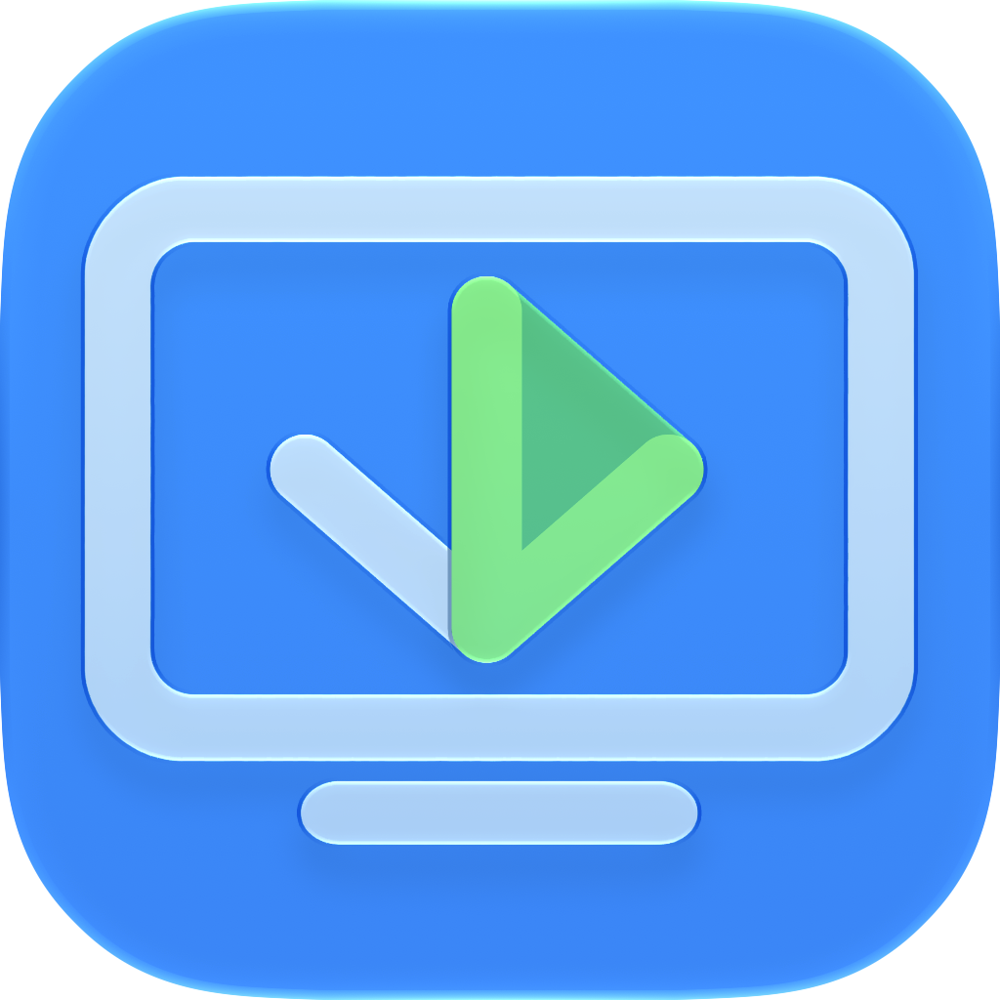
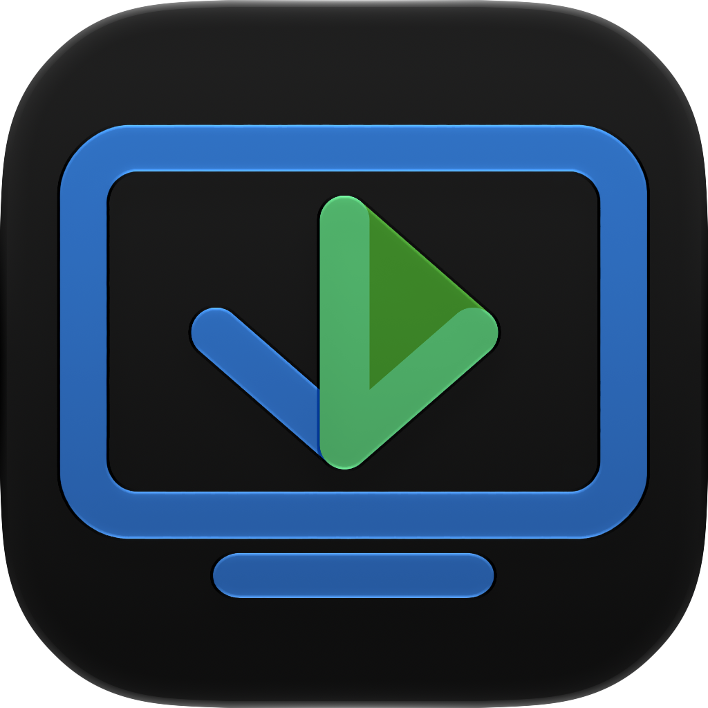
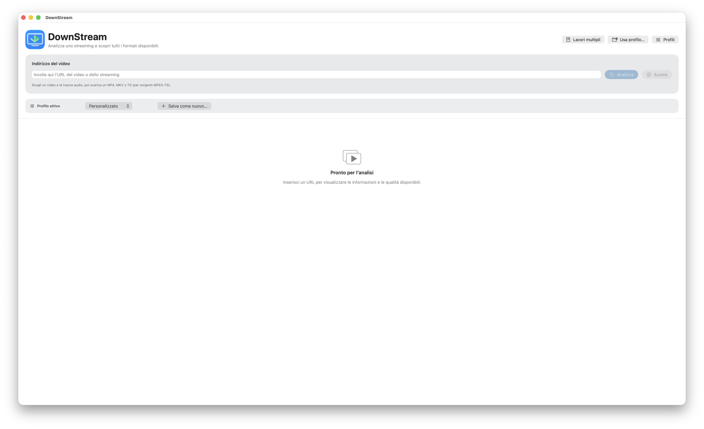
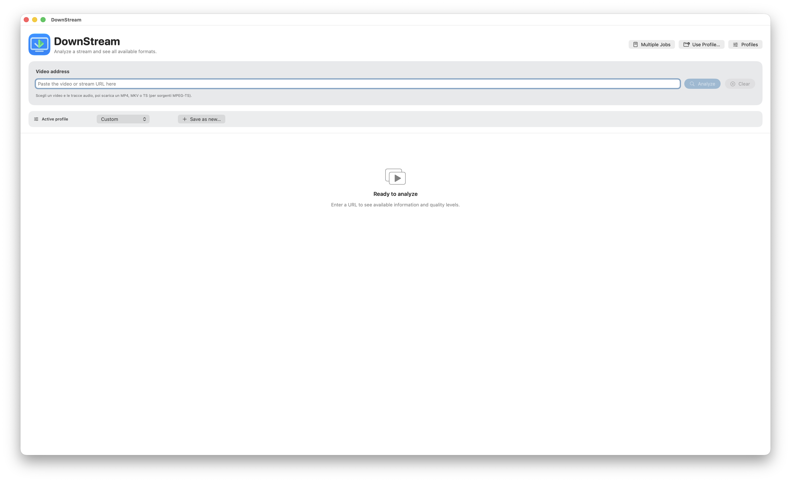

# DownStream

<p align="center">
  
  &nbsp;&nbsp;&nbsp;&nbsp;
  
</p>

<p align="center">
  <strong>Analizza, configura e scarica flussi HLS con un'interfaccia macOS nativa.</strong><br>
  <strong>Analyze, configure and download HLS streams with a native macOS interface.</strong>
</p>

<p align="center">
  <a href="#italiano">Italiano</a> ·
  <a href="#english">English</a>
</p>

---

# Italiano

## Cos'è DownStream?

**DownStream** è un'app macOS pensata per analizzare flussi HLS/M3U8 e gestire in modo visuale download che normalmente richiederebbero più strumenti da riga di comando.

L'app riunisce analisi dei formati, selezione delle tracce, sottotitoli, profili, coda di download, recupero dei frammenti e creazione del file finale in un'unica interfaccia.

DownStream utilizza diversi strumenti open source consolidati — tra cui yt-dlp, FFmpeg, mkvmerge, MP4Box e Subler — mantenendoli separati dal codice originale dell'interfaccia e del motore di orchestrazione dell'app.

<p align="center">
  
</p>

## Funzioni principali

- analisi di URL e playlist **HLS/M3U8**;
- rilevamento delle varianti video e delle tracce audio disponibili;
- selezione manuale di video e audio, inclusa la selezione di più tracce audio quando supportata;
- gestione dei sottotitoli HLS, incluse varianti **Normal, Forced e SDH** quando dichiarate dalla sorgente;
- nomi SRT distinti anche in presenza di più sottotitoli con la stessa lingua;
- esportazione in **MP4**, **MKV** e, quando compatibile con la sorgente, **TS**;
- gestione dell'audio esterno con flussi di mantenimento, sostituzione o utilizzo del solo audio selezionato;
- profili riutilizzabili e profili temporanei;
- importazione e gestione di più lavori nella **coda**;
- download simultanei configurabili;
- pausa, ripresa, stop e salto dei lavori in coda;
- retry automatici e recupero dei frammenti HLS quando un download presenta parti mancanti o problematiche;
- progresso monotono e riepilogo leggibile dell'attività HLS;
- cronologia e log opzionali per diagnosi più dettagliate;
- supporto a flussi moderni HLS/fMP4 e a sorgenti TS più datate;
- normalizzazione/remux senza ricodifica quando necessaria per migliorare la compatibilità del file finale.

## Contenitori e audio

DownStream può produrre output differenti in base alla sorgente e alla configurazione scelta.

- **MP4** — formato principale per la compatibilità con l'ecosistema Apple e i player comuni;
- **MKV** — utile quando si desidera mantenere più tracce e metadati in un contenitore flessibile;
- **TS** — disponibile solo nei casi in cui la sorgente originale e il percorso selezionato lo consentono.

Per alcuni flussi MP4 con audio esterno, DownStream può utilizzare **MP4Box** o **Subler** per completare il mux finale.

## Sottotitoli

DownStream distingue le rendition HLS anche quando condividono la stessa lingua. Quando la sorgente lo dichiara, l'interfaccia può separare sottotitoli normali, forced e SDH e genera nomi SRT privi di collisioni.

## Coda e attività

Più lavori possono essere preparati e gestiti dalla coda. La coda supporta download simultanei, pausa/ripresa, stop, salto e retry. La cronologia conserva il risultato dei lavori completati e i log dettagliati possono essere attivati quando serve una diagnosi più approfondita.

## Profili

Le configurazioni possono essere salvate come profili e riutilizzate. È inoltre possibile applicare profili temporaneamente senza sostituire la configurazione permanente corrente.

## Compatibilità

- **macOS 15 Sequoia o successivo**
- **Mac con Apple Silicon** oppure **Mac Intel**

Sono disponibili tre pacchetti:

- **Apple Silicon** — per Mac con chip Apple;
- **Intel** — per Mac Intel;
- **Universal** — contiene entrambe le architetture ed è la scelta consigliata se non sei sicuro di quale versione scaricare.

## Installazione

1. Scarica il DMG adatto al tuo Mac dalla sezione **Releases**.
2. Apri il file `.dmg`.
3. Trascina **DownStream** nella cartella **Applicazioni**.
4. Avvia l'app.

DownStream e i DMG ufficiali sono firmati con **Apple Developer ID**, utilizzano **Hardened Runtime**, sono **notarizzati da Apple** e hanno il ticket di notarizzazione stapled nel pacchetto.

## Download 1.0.0

- `DownStream-1.0.0-Apple-Silicon.dmg`
- `DownStream-1.0.0-Intel.dmg`
- `DownStream-1.0.0-Universal.dmg`

Checksum SHA-256 ufficiali:

```text
e3c469027782488f8254526cf87db0f9b6bf9d820245248a26bcb3c08fd35bec  DownStream-1.0.0-Apple-Silicon.dmg
c6ed57242244ca5d37a69318f51568ee03f9fe29fa0482ec8fe233f6cfba32e0  DownStream-1.0.0-Intel.dmg
1e741ffacf178bac679429174bf85ff240bc0f8cc010dd5917553a27c68a2b1a  DownStream-1.0.0-Universal.dmg
```

## Uso responsabile

DownStream deve essere utilizzato esclusivamente con contenuti che sei autorizzato a scaricare, copiare o elaborare.

L'app **non è progettata per aggirare DRM o altre misure tecniche di protezione**.

## Feedback

Se trovi un flusso particolare, un comportamento inatteso o qualcosa che può essere migliorato, puoi aprire una **GitHub Issue**.

## Note di rilascio

- [Note di rilascio 1.0.0 — Italiano](release-notes/RELEASE_NOTES_1.0.0_IT.md)
- [Release notes 1.0.0 — English](release-notes/RELEASE_NOTES_1.0.0_EN.md)

## Licenza

Le parti originali e proprietarie dei binari di DownStream sono distribuite secondo la [DownStream Proprietary Binary License](LICENSE.md).

DownStream include componenti di terze parti soggetti alle rispettive licenze open source. Consulta [THIRD_PARTY_NOTICES.md](THIRD_PARTY_NOTICES.md) per dettagli.

---

# English

## What is DownStream?

**DownStream** is a macOS application designed to analyze HLS/M3U8 streams and visually manage downloads that would otherwise require several command-line tools.

It brings format analysis, track selection, subtitles, profiles, download queues, fragment recovery, and final-file creation into a single interface.

DownStream uses established open-source tools — including yt-dlp, FFmpeg, mkvmerge, MP4Box, and Subler — while keeping those components separate from the app's original interface and orchestration code.

<p align="center">
  
</p>

## Main features

- analysis of URLs and **HLS/M3U8** playlists;
- detection of available video variants and audio tracks;
- manual video/audio selection, including multiple audio tracks where supported;
- HLS subtitle handling, including **Normal, Forced, and SDH** variants when declared by the source;
- collision-free SRT names even when several subtitle tracks share the same language;
- output to **MP4**, **MKV**, and — where compatible with the source — **TS**;
- external-audio workflows for keeping, replacing, or using only the selected external audio;
- reusable profiles and temporary profiles;
- import and management of multiple jobs in the **queue**;
- configurable simultaneous downloads;
- pause, resume, stop, and skip controls for queued jobs;
- automatic retries and HLS fragment recovery when downloads contain missing or problematic parts;
- monotonic progress reporting and readable HLS activity summaries;
- history and optional detailed logs for diagnosis;
- support for modern HLS/fMP4 streams and older TS-based sources;
- remux/normalization without re-encoding when needed to improve final-file compatibility.

## Containers and audio

DownStream can produce different outputs depending on the source and selected configuration.

- **MP4** — the primary choice for compatibility with the Apple ecosystem and common players;
- **MKV** — useful when several tracks and metadata should remain in a flexible container;
- **TS** — available only when the original source and selected workflow support it.

For some MP4 workflows with external audio, DownStream can use **MP4Box** or **Subler** to complete the final mux.

## Subtitles

DownStream distinguishes HLS renditions even when they share the same language. When the source declares the relevant metadata, normal, forced, and SDH subtitles can be presented separately and downloaded with collision-free SRT filenames.

## Queue and activity

Multiple jobs can be prepared and managed from the queue. The queue supports simultaneous downloads, pause/resume, stop, skip, and retry. History keeps track of completed jobs, while detailed logs can be enabled when deeper diagnosis is needed.

## Profiles

Configurations can be saved as profiles and reused. Profiles can also be applied temporarily without replacing the current permanent configuration.

## Compatibility

- **macOS 15 Sequoia or later**
- **Apple Silicon Mac** or **Intel Mac**

Three packages are available:

- **Apple Silicon** — for Macs with Apple chips;
- **Intel** — for Intel-based Macs;
- **Universal** — contains both architectures and is recommended if you are unsure which build to download.

## Installation

1. Download the appropriate DMG from **Releases**.
2. Open the `.dmg` file.
3. Drag **DownStream** into **Applications**.
4. Launch the app.

DownStream and the official DMGs are signed with **Apple Developer ID**, use **Hardened Runtime**, are **notarized by Apple**, and carry a stapled notarization ticket.

## Downloads 1.0.0

- `DownStream-1.0.0-Apple-Silicon.dmg`
- `DownStream-1.0.0-Intel.dmg`
- `DownStream-1.0.0-Universal.dmg`

Official SHA-256 checksums:

```text
e3c469027782488f8254526cf87db0f9b6bf9d820245248a26bcb3c08fd35bec  DownStream-1.0.0-Apple-Silicon.dmg
c6ed57242244ca5d37a69318f51568ee03f9fe29fa0482ec8fe233f6cfba32e0  DownStream-1.0.0-Intel.dmg
1e741ffacf178bac679429174bf85ff240bc0f8cc010dd5917553a27c68a2b1a  DownStream-1.0.0-Universal.dmg
```

## Responsible use

Use DownStream only with content that you are authorized to download, copy, or process.

The app **is not designed to circumvent DRM or other technical protection measures**.

## Feedback

If you encounter an unusual stream, unexpected behavior, or something that could be improved, feel free to open a **GitHub Issue**.

## Release notes

- [Release notes 1.0.0 — English](release-notes/RELEASE_NOTES_1.0.0_EN.md)
- [Note di rilascio 1.0.0 — Italiano](release-notes/RELEASE_NOTES_1.0.0_IT.md)

## License

The original proprietary portions of the DownStream binaries are distributed under the [DownStream Proprietary Binary License](LICENSE.md).

DownStream includes third-party components governed by their respective open-source licenses. See [THIRD_PARTY_NOTICES.md](THIRD_PARTY_NOTICES.md) for details.
